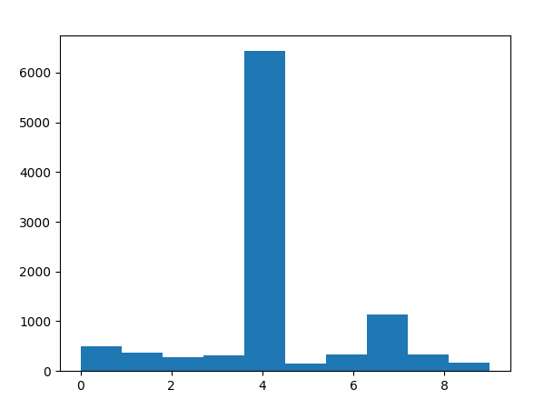

# UCB (Upper Confidence Bound) Algoritması İle Reklam Seçimi

Yaptığım projede ise UCB algoritmasının kullanım amacı reklam bütçesini en iyi şekilde kullanarak hedef kitle ile etkileşimi arttırmaktır.

UCB algoritması, çok-armed bandit problemleri gibi belirli türdeki problem setleri için tasarlanmış bir pekiştirmeli öğrenme ve karar verme algoritmasıdır. Bu algoritmanın amacı, belirli birçok seçenek arasında en iyi seçeneği bulmak ve bu seçeneği seçerek toplam ödülü maksimize etmektir.

## Algoritma Çalışma Mantığı

* UCB algoritması başlangıçta her bir seçeneğin gerçek değerini bilmez. Bu nedenle, her bir seçeneğin başlangıç tahmini değeri ve seçilme sayısı sıfır olarak başlar.
* Her aşamada, algoritma bir seçenek arasında karar verir ve bu seçeneği seçer. Bu seçenek, henüz keşfedilmemiş olan bir seçenek olabilir (keşfetme), ya da şu ana kadar en iyi performans gösteren bir seçenek olabilir (exploit etme).
* Seçilen her bir seçenek için, UCB skoru hesaplanır. Bu skor, seçeneğin şu ana kadar gözlemlenen ortalama ödülü ve güven aralığı kombinasyonunu içerir.
* Hesaplanan UCB skorlarına dayanarak, en yüksek skora sahip olan seçenek seçilir ve bu seçenek uygulanır. Bu adım, daha önce keşfedilmemiş olan seçeneklere yönelme ve en iyi performans gösteren seçenekleri exploit etme arasında bir denge kurar.
* Seçilen seçeneğin gerçek ödülü gözlemlenir. Bu ödül, algoritmanın o seçeneğin gerçek değeri hakkında daha iyi bir tahmin yapmasına yardımcı olur. Bu gözlemleme sonucunda, seçilen seçeneğin ortalama ödülü güncellenir.
* Her aşamada, toplam deneme sayısı (t) bir artırılır. Bu sayede güven aralığı daralır ve algoritma daha fazla güvenilir tahminler yapabilir.
* Belirli bir aşama sayısına veya belirli bir duruma ulaşılıncaya kadar adımlar tekrarlanır. Bu sayede algoritma zaman içinde en iyi performans gösteren seçeneklere odaklanabilir.

